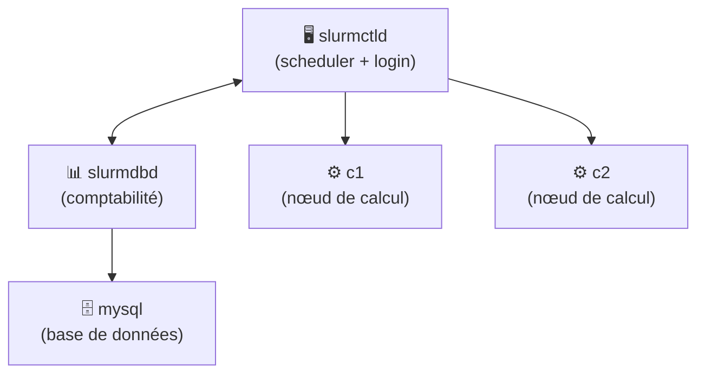
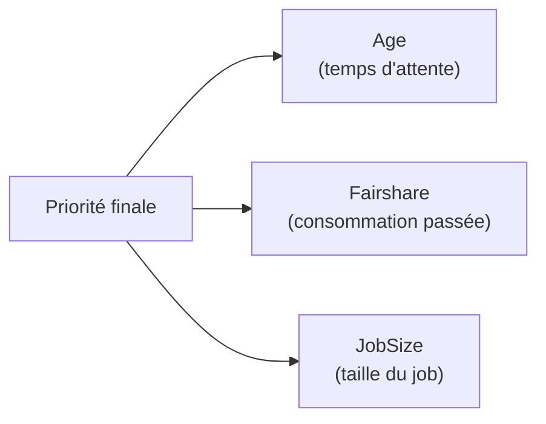
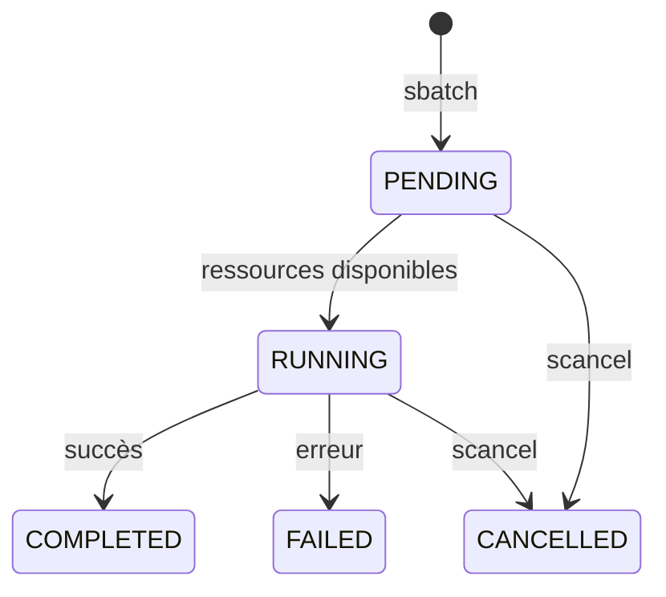

# Architecture du cluster Slurm

## Vue d'ensemble

Cluster HPC complet déployé sur Docker Compose simulant un environnement de production.



## Composants

| Conteneur | Rôle | Description |
|-----------|------|-------------|
| `slurmctld` | Contrôleur | Scheduler central, nœud de login, point d'entrée admin |
| `slurmdbd` | Comptabilité | Enregistre la consommation des jobs, gère les comptes |
| `mysql` | Base de données | Stockage persistant pour slurmdbd |
| `c1`, `c2` | Calcul | Nœuds qui exécutent les jobs |

## Configuration des ressources

| Nœud | CPUs | RAM | Partition |
|------|------|-----|-----------|
| c1 | 2 | 1000 MB | standard, long |
| c2 | 2 | 1000 MB | standard, long |

## Partitions configurées

| Partition | MaxTime | Nœuds | Usage |
|-----------|---------|-------|-------|
| `standard` | 1 heure | c1, c2 | Jobs courts |
| `long` | 24 heures | c1, c2 | Jobs longs |

## QOS configurée

| QOS | MaxCPUsPerUser | MaxJobsPerUser | Assignée à |
|-----|----------------|----------------|------------|
| `chercheur` | 4 | 2 | Utilisateurs chercheurs |

## Système de priorités



```
PriorityType=priority/multifactor
PriorityWeightAge=1000        # récompense les jobs qui attendent
PriorityWeightFairshare=1000  # pénalise les gros consommateurs
PriorityWeightJobSize=1000    # favorise les petits jobs
```

## Cycle de vie d'un job



## Ce qui a été pratiqué

**Administration**
- Gestion des états de nœuds : drain, resume, down
- Création de comptes et utilisateurs Slurm
- Configuration QOS et limites de ressources
- Analyse des priorités avec `sprio -l`

**Automatisation**
- Chaînage de jobs avec `--dependency=afterok`
- Script de création d'utilisateurs en masse
- Rapports de consommation avec `sreport`

**Monitoring et troubleshooting**
- Analyse des logs en temps réel (`tail -f slurmctld.log`)
- Diagnostic de jobs bloqués
- Gestion des erreurs silencieuses avec `set -e`
- Supervision mémoire avec `sstat`

## Lancer le cluster

```bash
git clone https://github.com/Kaido-Borsalino/slurm-hpc-lab
cd slurm-hpc-lab
docker compose up -d
docker exec -it slurmctld bash
sinfo  # vérifier que les nœuds sont up
```
